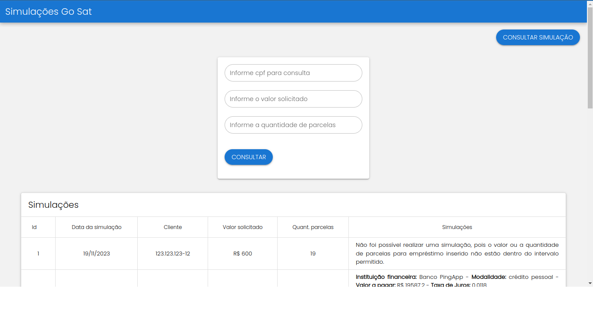

# Go sat

**Pessoa avaliada:** [Maria Baeta](https://github.com/mariabaeta27)

**Stacks**: VUE 3, TypeScript, Quasar

**Desafio**: Desenvolver um relatório gráfico para consumir [API Go Sat](https://github.com/mariabaeta27/api-go-sat)



## ATENÇÃO:

[Servidor](https://github.com/mariabaeta27/api-go-sat) da API Go Sat precisa está rodando em conjunto com esse projeto

## Setup do projeto

- Baixe o repositorio [Git](https://github.com/mariabaeta27/go_sat)
- Acesso a pasta do projeto

## Instale as dependências

```bash
yarn install
```

### Inicie o aplicativo no modo de desenvolvimento (recarregamento de código ativo, relatório de erros, etc.)

```bash
yarn  dev
```

### Lint os arquivos

```bash
yarn lint

```

### Formate os arquivos

```bash
yarn format

```

### Crie o aplicativo para produção

```bash
yarn build
```
